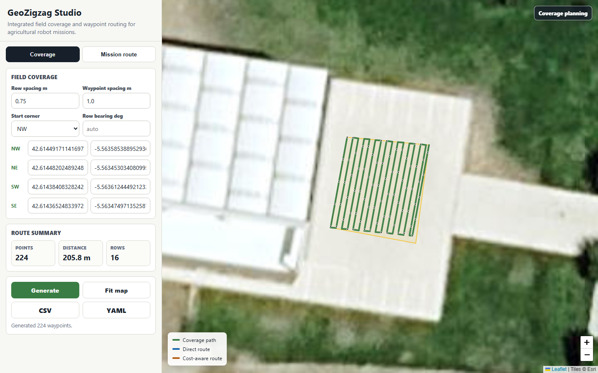
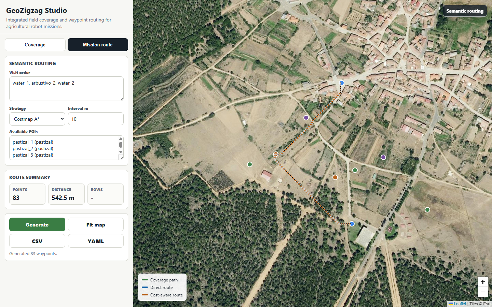

# GeoZigZag

GeoZigZag is a lightweight route-planning tool for agricultural robot missions.
It joins two practical workflows in one repository:

- **Field coverage**: generate back-and-forth zigzag waypoints from field corners.
- **Mission routing**: connect GeoJSON targets with direct or cost-aware routes.

The tool exports latitude, longitude, yaw, and planar quaternion values so the
same route can be inspected in the browser and reused by ROS-style waypoint
followers.

## Screenshots

### Field Coverage



### Mission Route



## Features

- Static Leaflet web app: open it directly or serve it from a local HTTP server.
- Editable WGS84 field corners, row spacing, waypoint spacing, start corner, and
  row bearing.
- GeoJSON mission targets with land-cover labels.
- Direct interpolation and costmap A* route generation.
- CSV and YAML exports for downstream robot navigation.
- Dependency-light Python core using only the standard library.

## Quick Start

### Web App

Open the file directly:

```text
web/index.html
```

Or serve the repository locally:

```powershell
py -3 -m http.server 8000 --bind 127.0.0.1
```

Then open:

```text
http://127.0.0.1:8000/web/index.html
```

The browser UI needs internet access for Leaflet and satellite map tiles.

To open the mission route view directly:

```text
http://127.0.0.1:8000/web/index.html?mode=mission&strategy=cost
```

### Command-Line Demo

From the repository root:

```powershell
py -m geozigzag.cli --out outputs
```

The demo reads `data/points.geojson` and writes reproducible route files to
`outputs/`.

## Output Files

The CLI generates:

- `outputs/coverage_zigzag.csv`
- `outputs/coverage_zigzag.yaml`
- `outputs/mission_direct.csv`
- `outputs/mission_direct.yaml`
- `outputs/mission_costmap.csv`
- `outputs/mission_costmap.yaml`
- `outputs/summary.json`

Generated output files are ignored by Git. The `outputs/.gitkeep` file only
keeps the folder available in fresh clones.

## Output Schema

CSV exports include:

| Field | Meaning |
| --- | --- |
| `latitude` | WGS84 latitude in degrees |
| `longitude` | WGS84 longitude in degrees |
| `yaw` | Heading in radians |
| `qx`, `qy`, `qz`, `qw` | Planar quaternion for ROS-style consumers |

YAML exports use the same route information in a waypoint list.

## Project Structure

```text
GeoZigZag/
|-- data/
|   `-- points.geojson
|-- docs/
|   `-- screenshots/
|-- geozigzag/
|   |-- __init__.py
|   |-- cli.py
|   `-- planning.py
|-- outputs/
|   `-- .gitkeep
|-- web/
|   `-- index.html
|-- .gitignore
|-- README.md
`-- requirements.txt
```

## Development Checks

Run the CLI smoke test:

```powershell
py -m geozigzag.cli --out outputs
```

Check that the public repository does not include generated route files:

```powershell
git status --short --ignored
```

The core planner is standard-library only. `requirements.txt` documents that
there are no required third-party Python runtime dependencies.
