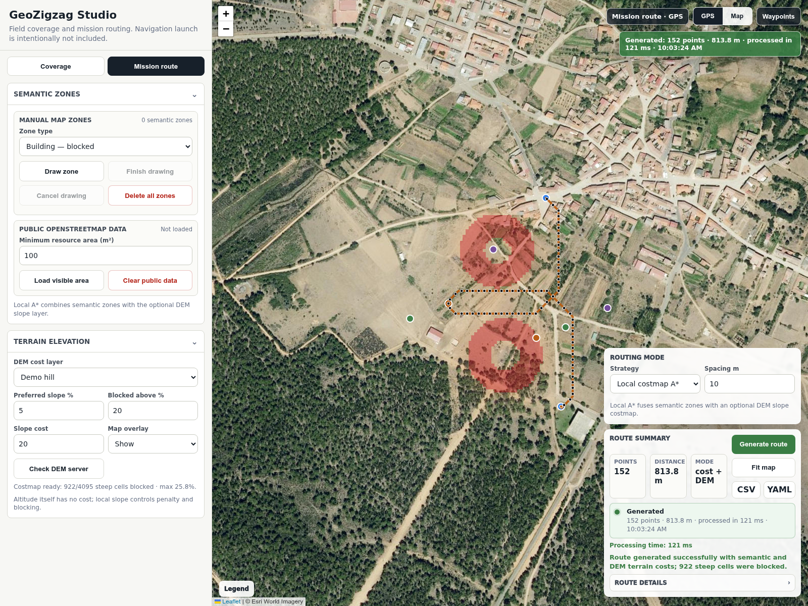
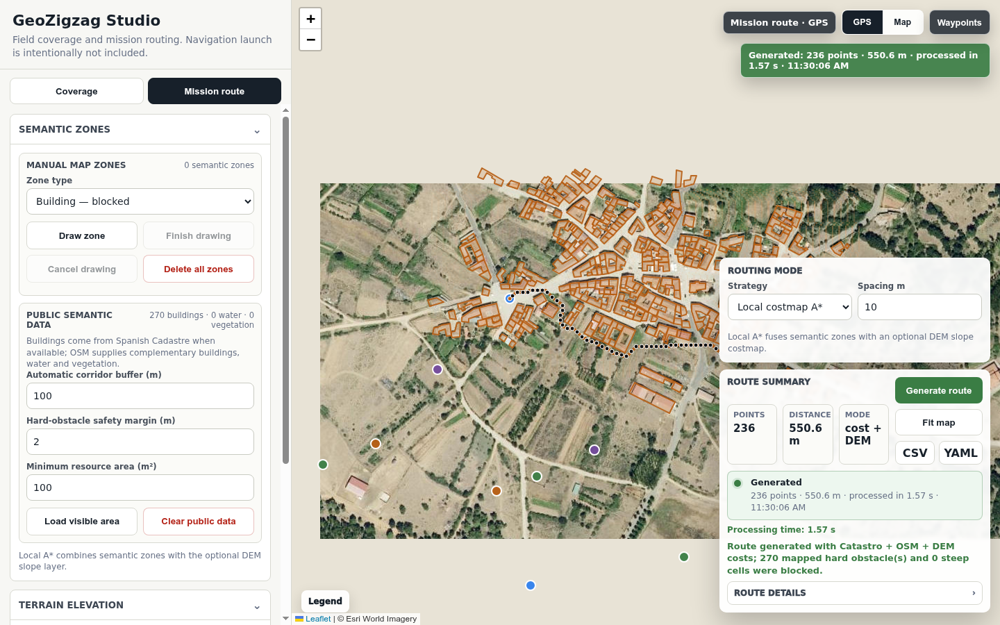

# GeoZigzag Studio

GeoZigzag Studio is a reproducible route-preparation workflow for agricultural
robotics. It combines:

- dense boustrophedon coverage inside a selected field; and
- sparse semantic georouting between ordered geographic targets.

The browser supports map-based editing, explicit route generation, manually
drawn building/water/forest zones, direct/local-cost/OSRM routing, visible
success and warning states, and CSV/YAML export. The Python package provides
the deterministic implementation used by the tests, benchmark, figures,
tables, and paper.

## Scope

This repository prepares and validates route files. It does not claim closed-
loop navigation, Gazebo completion, or physical robot validation. CSV/YAML
files are ROS-style interchange artifacts; a robot-side consumer must still
perform coordinate-frame conversion, localization, path tracking, and safety
checks.

See [the upstream integration audit](docs/upstream_integration_audit.md) for the
verified boundary with Geo2Gazebo, Wildboar, and Jabali CropFollow.

## Installation

```bash
git clone git@github.com:luispri2001/GeoZigZag.git
cd GeoZigZag

python3 -m venv .venv
source .venv/bin/activate
python3 -m pip install --upgrade pip
python3 -m pip install -r requirements.txt
```

Python 3.10 or newer is recommended. The planner uses standard-library
geometry; PyYAML reads experiment files and Matplotlib generates publication
figures.

Compiling the manuscript also requires Make, `latexmk`, IEEEtran, TikZ, and the
usual LaTeX graphics packages. On Ubuntu 22.04/24.04:

```bash
sudo apt install make latexmk texlive-latex-extra texlive-pictures
```

## Web interface

Start the included web/API server:

```bash
python3 scripts/osm_semantic_preload.py --serve-only
```

Open <http://127.0.0.1:8000/>. The normal URL opens **Mission route** with
**Local costmap A\*** and the real DEM server selected. Useful direct links are:

```text
http://127.0.0.1:8000/?mode=coverage
http://127.0.0.1:8000/
http://127.0.0.1:8000/?mode=mission&strategy=osm&preset=balanced
```

The first terrain request downloads real Terrarium elevation tiles from the
[AWS Open Data Terrain Tiles dataset](https://registry.opendata.aws/terrain-tiles/)
and caches them under `data/dem_cache/`; later requests for the same area work
from that local cache. Map tiles, uncached DEM areas, and live OSRM routing need
internet access. Editing a field, target list, spacing, route mode, or semantic
zone marks the existing route as pending and disables stale exports; press
**Generate route** to create a new result.

### Account for buildings, water, and forest

In **Mission route**, open **Semantic zones**. There are three inputs:

- in Spain, the official Cadastre INSPIRE WFS is the primary building source;
- OpenStreetMap supplies complementary buildings, water, forest and shrub
  areas (`scrub`, `shrubbery`, `heath`, and `landcover=shrubs`);
- choose a manual zone type and press **Draw zone** for missing or corrected
  features.

- buildings and water are impassable;
- forest has a high traversal cost, so local A* prefers a reasonable detour but
  can cross it when no practical alternative exists;
- scrub has a smaller traversal penalty.

Forest and scrub polygons above the configured minimum area create resource
waypoints at the center of the visible polygon. By default, up to six safe,
spatially distinct vegetation targets are inserted into the mission using a
minimum-detour ordering that preserves the original start and destination.
The UI can change the limit or switch to **Create only** for manual selection.
Candidates inside or too close to buildings/water are rejected. Buildings do
not create waypoints.

Choose **Local costmap A*** and press **Generate route**. Before planning, the
web application automatically requests both sources in a configurable corridor
around the mission. Catastro footprints take precedence over duplicate OSM
buildings. Buildings and water become hard obstacles in the same A* grid that
receives the DEM slope costs. The A* domain is limited to the downloaded public
data coverage, and the generated polyline is checked again with the configured
safety margin before export. A missing mandatory Catastro response in Spain,
an endpoint inside an obstacle, or a remaining intersection stops generation.

OSM **Balanced** and **Strict** validate buildings and water as hard
obstacles; forest cost is local to the A* strategy because the public OSRM
service does not accept this custom cost layer. Zones are stored in the
browser. Existing saved forbidden zones remain compatible and are interpreted
as buildings.

The browser requests `/api/catastro/buildings` and `/api/osm/semantic` in
parallel. The first endpoint transforms WGS84 to the correct ETRS89/UTM zone,
parses official GML and caches each bounded response for seven days. The OSM
endpoint falls back to public Overpass instances. A reproducible OSM cache can
be prepared before field work:

```bash
python3 scripts/osm_semantic_preload.py \
  --bbox 42.306 -6.208 42.316 -6.198 \
  --force --serve
```

OSM files are written under `web/osm_semantic_cache/`; Catastro responses are
written under `data/catastro_cache/`. Neither cache is committed. Use
`--no-catastro` only for locations outside its coverage or explicit diagnostic
comparisons. OpenStreetMap remains collaborative and potentially incomplete;
satellite imagery is visual context, not an automatic detector.

## Reproduce the paper results

```bash
make reproduce
```

This command runs the offline tests, evaluates the versioned scenarios,
generates route artifacts and figures, and compiles the IEEE manuscript. Main
outputs are:

```text
outputs/evaluation/results.csv
outputs/evaluation/sensitivity.csv
outputs/evaluation/summary.json
outputs/evaluation/paper_results.tex
outputs/evaluation/paper_coverage_results.tex
outputs/evaluation/figures/*.png
outputs/evaluation/routes/<scenario>/<strategy>/
paper/generated/paper_results.tex
paper/generated/paper_coverage_results.tex
paper/figures/generated/*.png
paper/build/main.pdf
paper/main.pdf
```

The generated paper table and figures are also versioned under `paper/`, so the
manuscript source and its publication assets remain together in the repository.

The evaluation never calls a live routing service. It uses the OSRM response
fixture in `data/osrm_fixture.json`, including its retrieval date, source,
profile, geometry, and snap distances.

Run individual stages with:

```bash
make test
make evaluate
make paper

python3 -m geozigzag.evaluate \
  --config configs/evaluation.yaml \
  --out outputs/evaluation
```

## CLI demo

The original compact demo remains available:

```bash
python3 -m geozigzag.cli --out outputs/demo
```

It generates coverage, direct mission, and local cost-aware mission routes.

## DEM-aware semantic navigation POC

The local semantic A* planner can fuse its building, water, forest, scrub and
land-cover costs with a DEM-derived slope layer. Steep cells are blocked and
moderate slopes add traversal cost. Run the deterministic hill demo:

```bash
python3 -m geozigzag.semantic_elevation_cli \
  --demo \
  --out outputs/semantic-elevation-poc
```

It exports the original semantic route, the semantic+DEM route, terrain-layer
metrics and a costmap preview without requiring Gazebo. Raw Terrain-RGB tiles
produced by `gazebo_terrain_generator` can be used with `--terrain-world`. See
[the semantic DEM costmap note](docs/semantic_elevation_costmap_poc.md).

The production web workflow does not use the synthetic hill. Start the server
and open the normal URL:

```bash
python3 scripts/osm_semantic_preload.py --serve-only

# Open in a browser:
http://localhost:8000/
```

Do not run the application as a standalone `file://` page: it needs the local
Catastro, OSM and DEM endpoints. If the versioned HTML file is opened directly,
it now redirects to `http://localhost:8000/web/index.html`; start the server
first with the command above.

By default this uses the real public Terrain Tiles DEM. Its European source is
appropriate for broad terrain gradients, but interpolation does not turn it
into a wheel-scale surface model. For Spain, a downloaded CNIG MDT02 GeoTIFF is
the preferred higher-resolution input. To use another real
source, pass either `--dem-geotiff /path/to/elevation.tif` or
`--terrain-world /path/to/world_name`. The teal/yellow/orange/red heatmap shows
gentle, moderate, costly, and blocked slope cells; hovering a cell reports its
sampled percentage. The exported route is the path produced by the
fused costmap. **Route details** reports ascent, descent, mean and maximum
absolute route slope, elevation range, and the configured preferred/blocked
slope thresholds. No source failure falls back to synthetic or flat elevation.
Multi-target missions reuse the same sampled DEM grid and rendered heatmap
across route segments. The browser A* uses a binary priority heap so automatic
vegetation targets do not multiply DEM downloads or repeatedly sort the full
open set.



The versioned example loads 270 official Catastro footprints plus complementary
OSM data. Its Catastro+OSM+DEM route contains 236 waypoints, is approximately
550.6 m long, and has at least 2 m configured clearance from every mapped hard
obstacle:



## Waypoint schema

CSV and YAML routes contain:

| Field | Definition |
| --- | --- |
| `latitude`, `longitude` | WGS84 coordinates in degrees |
| `yaw` | ENU heading in radians, counter-clockwise from east |
| `qx`, `qy`, `qz`, `qw` | Planar quaternion derived from yaw |

GeoJSON bundles contain one route `LineString` plus indexed waypoint features.

## Package layout

```text
geozigzag/
├── catastro.py       # official Spanish building-footprint adapter
├── elevation.py      # Terrarium, GeoTIFF, and Terrain-RGB DEM sources
├── terrain_costmap.py # slope penalties and traversability limits
├── geometry.py       # local projection, heading, polygon operations
├── coverage.py       # rectangle and polygon boustrophedon planners
├── routing.py        # direct, semantic-cost A*, DEM, and OSRM adapters
├── metrics.py        # distance, turns, area, forbidden intersections
├── export.py         # CSV, YAML, and GeoJSON
├── evaluation.py     # scenario execution, metrics, figures, tables
├── evaluate.py       # python -m evaluation entry point
├── planning.py       # stable planning facade
├── semantic_elevation_cli.py # deterministic terrain-planning POC
└── cli.py            # compact offline demo
```

Additional documentation:

- [Architecture and coordinate conventions](docs/architecture.md)
- [Reproducibility protocol](docs/reproducibility.md)
- [Geo2Gazebo/Wildboar/CropFollow audit](docs/upstream_integration_audit.md)

## Scientific interpretation

The local semantic-cost grid is a controlled planning proxy, not a calibrated
terrain model. Its point labels influence nearby cells and declared forbidden
polygons are impassable. Grid paths contain discrete corners and do not enforce
vehicle footprint, turning radius, headland width, or dynamics. Cached OSRM
routes are included to measure network detours and snap distance, not to assert
that mapped roads are safe or reachable by an agricultural robot.

Please cite the paper in `paper/main.tex` when bibliographic details are final.
