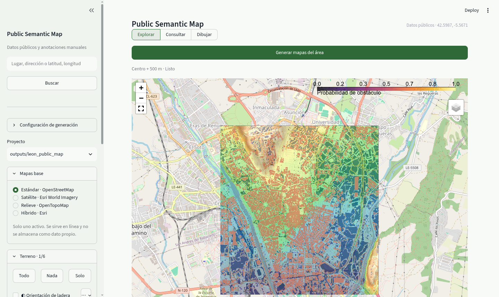
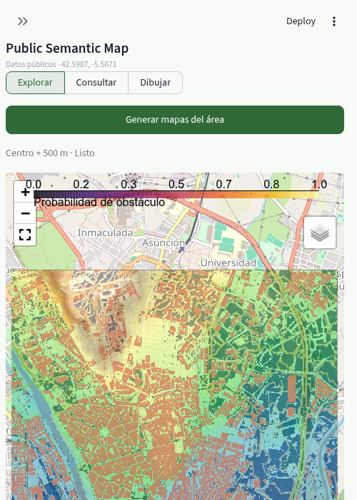

# Public Map Generator

Generador reproducible de **mapas previos de navegación** a partir de datos públicos, sin utilizar sensores ni datos del robot.

El sistema recibe una zona de interés —centro y radio, `bbox` o GeoJSON— y genera capas GeoTIFF georreferenciadas para elevación, pendiente, rugosidad, elementos de OpenStreetMap, obstáculos probables, humedad relativa estimada, confianza y coste de transitabilidad.

> El resultado es un **prior cartográfico**. No sustituye al LiDAR, las cámaras ni la detección local de obstáculos del robot.

## Fuentes implementadas

- **MDT05 IGN/CNIG**, mediante el WCS oficial de Modelos Digitales del Terreno.
- **Ortofoto PNOA Máxima Actualidad**, mediante el WMS oficial.
- **OpenStreetMap**, mediante Overpass: edificios, vías, agua, humedales, vegetación, parcelas y barreras.
- **MDS IGN/CNIG**, conector experimental y desactivado por defecto.
- **Sentinel-2 L2A**, opcional, mediante el catálogo STAC de Microsoft Planetary Computer para generar NDVI y NDMI.

## Capas generadas

```text
layers/
├── terrain/
│   ├── elevation.tif
│   ├── slope_degrees.tif
│   ├── aspect_degrees.tif
│   ├── roughness.tif
│   ├── local_relief.tif
│   └── max_neighbor_step.tif
├── osm/
│   ├── buildings.tif
│   ├── roads.tif
│   ├── water.tif
│   ├── waterways.tif
│   ├── wetlands.tif
│   ├── forest.tif
│   ├── farmland.tif
│   ├── grass.tif
│   ├── scrub.tif
│   └── barriers.tif
└── fusion/
    ├── surface_height.tif
    ├── wetness_prior.tif
    ├── vegetation_prior.tif
    ├── obstacle_probability.tif
    ├── traversability_prior.tif
    └── confidence.tif
```

También se generan:

- `public_navigation_map.tif`: GeoTIFF multibanda.
- `public_map.qgs`: proyecto básico para QGIS.
- `metadata.json`: procedencia, errores, límites, hashes y configuración de la cuadrícula.
- `preview/analysis_overview.png`: resumen visual.
- ortofoto original y alineada, cuando está activada.
- vectores OSM en GeoJSON.

## Instalación

### Opción 1: entorno Python

```bash
python3 -m venv .venv
source .venv/bin/activate
python -m pip install --upgrade pip
pip install -e '.[all,dev]'
```

Para la versión mínima, sin interfaz ni Sentinel-2:

```bash
pip install -e .
```

### Opción 2: Docker

```bash
docker compose up --build
```

La interfaz estará en `http://localhost:8501` y las salidas se guardarán en `outputs/`.

## Uso rápido

Primero comprueba la instalación sin conexión:

```bash
pmg synthetic-demo --output demo_output
```

Valida una configuración:

```bash
pmg validate-config config/minimal_leon.yaml
```

Genera un mapa real:

```bash
pmg generate config/minimal_leon.yaml
```

Versión con ortofoto y Sentinel-2:

```bash
pmg generate config/full_leon.yaml
```

Interfaz gráfica:

```bash
streamlit run app.py
```

La interfaz principal es un planificador de rutas entre waypoints. El visor cartográfico permite
buscar lugares, dibujar o editar objetivos y revisar el resultado. Los mapas base, el relieve, los
edificios, el agua y las demás capas semánticas proporcionan contexto y costes al planificador, pero
no sustituyen la misión de waypoints. El proyecto, la ruta y las anotaciones se exportan en ZIP,
YAML, GeoJSON y CSV.
Consulta [docs/SEMANTIC_MAPPING.md](docs/SEMANTIC_MAPPING.md) para el flujo completo.

La acción **Generar mapas del área** intenta automáticamente MDT, PNOA, OpenStreetMap, MDS y
Sentinel-2. La generación se ejecuta en segundo plano, publica estado por fuente y deja el mapa
operativo. Las fuentes independientes se descargan con concurrencia limitada; un fallo opcional no
cancela las demás. Si área y resolución no han cambiado se reutiliza el proyecto almacenado.

## Planificación semántica de rutas

El panel **Planificación de ruta** conserva el flujo de misiones por waypoints de GeoZigZag:

- origen editable mediante latitud y longitud WGS84; el ejemplo inicial es Tabuyo del Monte
  (`42.3135981, -6.2027894`);
- tabla dinámica para añadir, editar, eliminar y ordenar waypoints manuales;
- importación de los vértices de una línea dibujada o de un punto consultado;
- creación opcional de waypoints automáticos para masas de bosque, matorral, agua, cursos de agua,
  humedales, pastizal o cultivo;
- conexión A* de todos los objetivos en el orden manual, seguida de los objetivos automáticos
  ordenados por proximidad.

Los objetivos manuales aparecen en naranja y los recursos semánticos en morado. Si el interior de
una masa forestal no es transitable —o el recurso es agua— el objetivo se coloca en el punto de
aproximación alcanzable más cercano y se registra `target_relation: approach_to_feature` y su
distancia al recurso.

El perfil predeterminado usa únicamente información relevante para la ruta nueva:

- edificios, agua, cursos de agua y barreras como bloqueos duros;
- pendiente y escalón máximo como límites y costes;
- probabilidad alta de obstáculo como coste, no como detección confirmada;
- caminos como preferencia configurable.

Bosque, matorral, cultivo y pastizal no se convierten automáticamente en obstáculos. Agua, cursos de
agua y humedales sí bloquean la trayectoria, pero pueden generar simultáneamente un waypoint seguro
de aproximación como recurso de misión. NDVI, NDMI, humedad y riesgos inferidos no crean objetivos
por sí solos. Cada ruta se guarda sin sobrescritura en `routes/<nombre>_<timestamp>/` con CSV, YAML,
GeoJSON y métricas JSON; también queda incluida en el ZIP del proyecto.

La geometría de cobertura y la estructura A* reutilizan y adaptan la lógica del proyecto
[GeoZigZag](https://github.com/luispri2001/GeoZigZag), sustituyendo su rejilla semántica sintética
por las capas ráster alineadas de este proyecto.





## Configuración de la zona

### Centro y radio

```yaml
aoi:
  type: center_radius
  lat: 42.5987
  lon: -5.5671
  radius_m: 500
```

### Bounding box WGS84

```yaml
aoi:
  type: bbox
  bbox: [-5.58, 42.59, -5.55, 42.61]
```

### GeoJSON

```yaml
aoi:
  type: geojson
  path: example_aoi/parcela.geojson
```

## Resolución

La configuración por defecto utiliza `EPSG:25830` y celdas de 5 m:

```yaml
grid:
  crs: EPSG:25830
  resolution_m: 5.0
```

Aunque se configure una salida de 1 o 2 m, el MDT05 sigue teniendo una resolución fuente de 5 m. El remuestreo no crea detalle geométrico real.

La ortofoto se descarga separadamente a 0,5 m por defecto y después se genera una copia alineada con la cuadrícula principal.

## Lógica de fusión

El coste de transitabilidad combina:

- pendiente;
- rugosidad;
- salto máximo entre vecinos;
- edificios, agua, barreras y vegetación de OSM;
- altura sobre el terreno si se activa el MDS;
- humedad relativa estimada;
- una bonificación por vías cartografiadas.

Los umbrales y pesos se encuentran en el YAML:

```yaml
terrain:
  slope_warning_deg: 12.0
  slope_blocked_deg: 25.0
  roughness_warning_m: 0.20
  roughness_blocked_m: 0.60
  max_step_warning_m: 0.20
  max_step_blocked_m: 0.45

weights:
  slope: 0.24
  roughness: 0.20
  max_step: 0.18
  obstacles: 0.28
  wetness: 0.10
  road_bonus: 0.20
```

Estos valores son iniciales. Deben ajustarse a la pendiente máxima, altura superable, ancho, distancia al suelo y comportamiento real del robot.

## `wetness_prior`

`wetness_prior` no es una medición de humedad. Es una estimación relativa obtenida a partir de:

- proximidad a agua y humedales cartografiados;
- pendiente y relieve local;
- NDMI de Sentinel-2, cuando está activado.

No debe utilizarse como prueba de que existe barro o un charco.

## Estructura del proyecto

```text
public_map_generator/
├── app.py
├── config/
├── docs/
├── example_aoi/
├── scripts/
├── src/public_map_generator/
│   ├── sources/
│   ├── aoi.py
│   ├── config.py
│   ├── fusion.py
│   ├── grid.py
│   ├── pipeline.py
│   ├── route_planner.py
│   ├── rasterize.py
│   └── terrain.py
└── tests/
```

## Pruebas

```bash
PYTEST_DISABLE_PLUGIN_AUTOLOAD=1 pytest -q
```

La variable evita que `pytest` cargue plugins externos de instalaciones ROS 2 del sistema; no
desactiva ningún plugin requerido por estas pruebas.

Las pruebas incluidas verifican la creación del AOI, el cálculo de pendiente, la conservación de
zonas sin datos, la fusión de edificios y caminos, la evasión de obstáculos mediante A*, la
exclusión predeterminada de matorral y las exportaciones de rutas.

## Límites conocidos

- No detecta obstáculos pequeños o temporales: troncos, piedras, maquinaria, ramas o charcos recientes.
- OSM puede estar incompleto o desactualizado.
- El MDS de alta resolución no está activado por defecto porque la cobertura y el comportamiento del servicio pueden variar.
- La ortofoto WMS es una imagen de visualización; no contiene por sí sola profundidad ni clasificación semántica.
- Sentinel-2 tiene una resolución de 10–20 m para las bandas utilizadas.
- La transitabilidad calculada es una hipótesis configurable, no una certificación de seguridad.
- El planificador es global y previo: antes de ejecutar una ruta real debe combinarse con percepción
  local, límites cinemáticos y parada de emergencia.

## Reconocimiento de datos

Al publicar resultados, conserva el reconocimiento exigido por cada fuente. Para los productos del IGN/CNIG, consulta su licencia de uso y menciona el origen de los datos. Los datos de OpenStreetMap requieren atribución a sus colaboradores.

## Servicios utilizados

- MDT WCS: `https://servicios.idee.es/wcs-inspire/mdt`
- PNOA WMS: `https://www.ign.es/wms-inspire/pnoa-ma`
- MDS WCS experimental: `https://wcs-mds.idee.es/mds`
- Overpass: `https://overpass-api.de/api/interpreter`
- Planetary Computer STAC: `https://planetarycomputer.microsoft.com/api/stac/v1`
